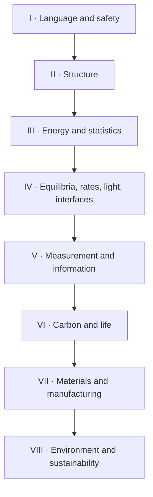

# Topic Dependency Graph

Repository graph audited at commit `4fa3d18928395d0216c4940d32e5c366f3a4e13c`. The publication graph below distinguishes repository declarations from editorial dependency repairs.

## Repository graph audit

| Metric | Result |
| --- | ---: |
| Node mentions across `nodes*.yaml` | 93 |
| Unique nodes | 76 |
| Duplicate node mentions | 17 |
| Edge mentions across `edges*.yaml` | 97 |
| Unique edge triplets | 79 |
| Duplicate edge mentions | 18 |
| Missing edge endpoints | quantum-mechanics |
| Topic nodes absent from graph | None |
| Non-topic nodes | 36 |

## Publication dependency spine

## Normalized topic order

| Ch. | Topic | Pages | Repository-declared prerequisites | Publication prerequisites | External prerequisite capsules | Dependency disposition |
| ---: | --- | --- | --- | --- | --- | --- |
| 1 | Laboratory Safety | 11–18 | chemical-hazards, laboratory-methods | None | chemical-hazards, laboratory-methods | Topologically valid |
| 2 | Atomic Structure | 19–26 | scientific-measurement, electrostatics | None | scientific-measurement, electrostatics | Topologically valid |
| 3 | Periodic Table | 27–34 | atomic-structure, atomic-number, isotopes | atomic-structure | atomic-number, isotopes | Topologically valid |
| 4 | Stoichiometry | 35–42 | atomic-structure, mole-concept, chemical-equations | atomic-structure, periodic-table | mole-concept, chemical-equations | Topologically valid |
| 5 | Quantum Chemistry | 45–52 | atomic-structure, chemical-bonding, statistical-mechanics, mathematics | atomic-structure | mathematics | Topologically valid |
| 6 | Chemical Bonding | 53–60 | atomic-structure, periodic-table, electron-configuration | atomic-structure, periodic-table, quantum-chemistry | electron-configuration | Topologically valid |
| 7 | Inorganic Chemistry | 61–68 | periodic-table, atomic-structure, chemical-bonding | periodic-table, chemical-bonding, stoichiometry | None | Topologically valid |
| 8 | Coordination Chemistry | 69–76 | inorganic-chemistry, chemical-bonding, acids-and-bases | inorganic-chemistry, chemical-bonding | None | Topologically valid |
| 9 | Crystallography | 77–84 | atomic-structure, chemical-bonding, materials-chemistry, spectroscopy | atomic-structure, chemical-bonding | None | Topologically valid |
| 10 | Nuclear Chemistry | 85–92 | atomic-structure, isotopes, periodic-table | atomic-structure, periodic-table, stoichiometry | isotopes | Topologically valid |
| 11 | Thermochemistry | 95–102 | stoichiometry, energy, temperature | stoichiometry | energy, temperature | Topologically valid |
| 12 | Chemical Thermodynamics | 103–110 | thermochemistry, stoichiometry, mathematical-functions | thermochemistry, stoichiometry | mathematical-functions | Topologically valid |
| 13 | Statistical Mechanics | 111–118 | chemical-thermodynamics, probability, calculus, classical-mechanics | chemical-thermodynamics, quantum-chemistry | probability, calculus, classical-mechanics | Topologically valid |
| 14 | Solutions and Colloids | 121–128 | chemical-bonding, intermolecular-forces, chemical-equilibrium | chemical-bonding, chemical-thermodynamics | intermolecular-forces | Topologically valid |
| 15 | Chemical Equilibrium | 129–136 | stoichiometry, chemical-kinetics, chemical-thermodynamics | stoichiometry, chemical-thermodynamics, solutions-and-colloids | None | Topologically valid |
| 16 | Acids and Bases | 137–144 | chemical-equilibrium, aqueous-solutions, logarithms | chemical-equilibrium, solutions-and-colloids | aqueous-solutions, logarithms | Topologically valid |
| 17 | Solubility | 145–152 | solutions-and-colloids, chemical-equilibrium, chemical-thermodynamics | solutions-and-colloids, chemical-equilibrium, acids-and-bases | None | Topologically valid |
| 18 | Electrochemistry | 153–160 | chemical-thermodynamics, chemical-equilibrium, acids-and-bases, oxidation-reduction | chemical-thermodynamics, chemical-equilibrium, acids-and-bases | oxidation-reduction | Topologically valid |
| 19 | Chemical Kinetics | 161–168 | stoichiometry, chemical-bonding, chemical-thermodynamics | stoichiometry, chemical-thermodynamics, chemical-bonding | None | Topologically valid |
| 20 | Photochemistry | 169–176 | spectroscopy, quantum-chemistry, organic-chemistry, chemical-kinetics | quantum-chemistry, chemical-kinetics | None | Topologically valid |
| 21 | Surface Chemistry | 177–184 | solutions-and-colloids, materials-chemistry, chemical-thermodynamics | solutions-and-colloids, chemical-bonding, chemical-thermodynamics | None | Topologically valid |
| 22 | Catalysis | 185–192 | chemical-kinetics, chemical-thermodynamics, chemical-bonding | chemical-kinetics, chemical-thermodynamics, chemical-bonding, surface-chemistry | None | Topologically valid |
| 23 | Analytical Chemistry | 195–202 | stoichiometry, acids-and-bases, spectroscopy, electrochemistry | stoichiometry, chemical-equilibrium, acids-and-bases | None | Topologically valid |
| 24 | Spectroscopy | 203–210 | atomic-structure, chemical-bonding, quantum-mechanics | atomic-structure, chemical-bonding, quantum-chemistry, analytical-chemistry | quantum-mechanics | Topologically valid |
| 25 | Mass Spectrometry | 211–218 | analytical-chemistry, spectroscopy, chromatography, organic-chemistry | analytical-chemistry, chemical-bonding | None | Topologically valid |
| 26 | Chromatography | 219–226 | analytical-chemistry, solutions-and-colloids, surface-chemistry | analytical-chemistry, solutions-and-colloids, surface-chemistry | None | Topologically valid |
| 27 | Cheminformatics | 227–234 | organic-chemistry, analytical-chemistry, spectroscopy, data-science | chemical-bonding, analytical-chemistry, spectroscopy | data-science | Topologically valid |
| 28 | Organic Chemistry | 237–244 | atomic-structure, chemical-bonding, acids-and-bases, spectroscopy | chemical-bonding, acids-and-bases, chemical-kinetics | None | Topologically valid |
| 29 | Biochemistry | 245–252 | organic-chemistry, acids-and-bases, chemical-equilibrium, spectroscopy | organic-chemistry, acids-and-bases, chemical-equilibrium | None | Topologically valid |
| 30 | Medicinal Chemistry | 253–260 | organic-chemistry, biochemistry, analytical-chemistry, spectroscopy | organic-chemistry, biochemistry, analytical-chemistry | None | Topologically valid |
| 31 | Polymer Chemistry | 261–268 | organic-chemistry, materials-chemistry, chemical-kinetics | organic-chemistry, chemical-kinetics, chemical-bonding | None | Topologically valid |
| 32 | Food Chemistry | 269–276 | organic-chemistry, analytical-chemistry, biochemistry, chromatography, mass-spectrometry | organic-chemistry, biochemistry, analytical-chemistry | None | Topologically valid |
| 33 | Clinical Chemistry | 277–284 | analytical-chemistry, biochemistry, toxicology, spectroscopy | analytical-chemistry, biochemistry | None | Topologically valid |
| 34 | Materials Chemistry | 287–294 | chemical-bonding, inorganic-chemistry, organic-chemistry, spectroscopy | chemical-bonding, inorganic-chemistry, organic-chemistry, crystallography | None | Topologically valid |
| 35 | Chemical Engineering | 295–302 | chemical-thermodynamics, chemical-kinetics, stoichiometry, mathematics | stoichiometry, chemical-thermodynamics, chemical-kinetics, chemical-equilibrium | mathematics | Topologically valid |
| 36 | Environmental Chemistry | 305–312 | analytical-chemistry, acids-and-bases, chemical-equilibrium, organic-chemistry | analytical-chemistry, chemical-equilibrium, organic-chemistry | None | Topologically valid |
| 37 | Atmospheric Chemistry | 313–320 | environmental-chemistry, photochemistry, chemical-kinetics, analytical-chemistry | environmental-chemistry, photochemistry, chemical-kinetics | None | Topologically valid |
| 38 | Toxicology | 321–328 | biochemistry, medicinal-chemistry, analytical-chemistry, laboratory-safety | biochemistry, medicinal-chemistry, analytical-chemistry, laboratory-safety | None | Topologically valid |
| 39 | Ecotoxicology | 329–336 | environmental-chemistry, toxicology, analytical-chemistry, biochemistry | environmental-chemistry, toxicology, analytical-chemistry | None | Topologically valid |
| 40 | Green Chemistry | 337–344 | organic-chemistry, catalysis, environmental-chemistry, laboratory-safety | organic-chemistry, catalysis, environmental-chemistry, chemical-engineering, laboratory-safety | None | Topologically valid |

## Normalized prerequisite edges

| From | To | Relation | Provenance |
| --- | --- | --- | --- |
| `atomic-structure` | `periodic-table` | prerequisite_for | Repository-declared |
| `atomic-structure` | `stoichiometry` | prerequisite_for | Repository-declared |
| `periodic-table` | `stoichiometry` | prerequisite_for | Editorial inference; chemistry SME review required |
| `atomic-structure` | `quantum-chemistry` | prerequisite_for | Repository-declared |
| `atomic-structure` | `chemical-bonding` | prerequisite_for | Repository-declared |
| `periodic-table` | `chemical-bonding` | prerequisite_for | Repository-declared |
| `quantum-chemistry` | `chemical-bonding` | prerequisite_for | Editorial inference; chemistry SME review required |
| `periodic-table` | `inorganic-chemistry` | prerequisite_for | Repository-declared |
| `chemical-bonding` | `inorganic-chemistry` | prerequisite_for | Repository-declared |
| `stoichiometry` | `inorganic-chemistry` | prerequisite_for | Editorial inference; chemistry SME review required |
| `inorganic-chemistry` | `coordination-chemistry` | prerequisite_for | Repository-declared |
| `chemical-bonding` | `coordination-chemistry` | prerequisite_for | Repository-declared |
| `atomic-structure` | `crystallography` | prerequisite_for | Repository-declared |
| `chemical-bonding` | `crystallography` | prerequisite_for | Repository-declared |
| `atomic-structure` | `nuclear-chemistry` | prerequisite_for | Repository-declared |
| `periodic-table` | `nuclear-chemistry` | prerequisite_for | Repository-declared |
| `stoichiometry` | `nuclear-chemistry` | prerequisite_for | Editorial inference; chemistry SME review required |
| `stoichiometry` | `thermochemistry` | prerequisite_for | Repository-declared |
| `thermochemistry` | `chemical-thermodynamics` | prerequisite_for | Repository-declared |
| `stoichiometry` | `chemical-thermodynamics` | prerequisite_for | Repository-declared |
| `chemical-thermodynamics` | `statistical-mechanics` | prerequisite_for | Repository-declared |
| `quantum-chemistry` | `statistical-mechanics` | prerequisite_for | Editorial inference; chemistry SME review required |
| `chemical-bonding` | `solutions-and-colloids` | prerequisite_for | Repository-declared |
| `chemical-thermodynamics` | `solutions-and-colloids` | prerequisite_for | Editorial inference; chemistry SME review required |
| `stoichiometry` | `chemical-equilibrium` | prerequisite_for | Repository-declared |
| `chemical-thermodynamics` | `chemical-equilibrium` | prerequisite_for | Repository-declared |
| `solutions-and-colloids` | `chemical-equilibrium` | prerequisite_for | Editorial inference; chemistry SME review required |
| `chemical-equilibrium` | `acids-and-bases` | prerequisite_for | Repository-declared |
| `solutions-and-colloids` | `acids-and-bases` | prerequisite_for | Editorial inference; chemistry SME review required |
| `solutions-and-colloids` | `solubility` | prerequisite_for | Repository-declared |
| `chemical-equilibrium` | `solubility` | prerequisite_for | Repository-declared |
| `acids-and-bases` | `solubility` | prerequisite_for | Editorial inference; chemistry SME review required |
| `chemical-thermodynamics` | `electrochemistry` | prerequisite_for | Repository-declared |
| `chemical-equilibrium` | `electrochemistry` | prerequisite_for | Repository-declared |
| `acids-and-bases` | `electrochemistry` | prerequisite_for | Repository-declared |
| `stoichiometry` | `chemical-kinetics` | prerequisite_for | Repository-declared |
| `chemical-thermodynamics` | `chemical-kinetics` | prerequisite_for | Repository-declared |
| `chemical-bonding` | `chemical-kinetics` | prerequisite_for | Repository-declared |
| `quantum-chemistry` | `photochemistry` | prerequisite_for | Repository-declared |
| `chemical-kinetics` | `photochemistry` | prerequisite_for | Repository-declared |
| `solutions-and-colloids` | `surface-chemistry` | prerequisite_for | Repository-declared |
| `chemical-bonding` | `surface-chemistry` | prerequisite_for | Editorial inference; chemistry SME review required |
| `chemical-thermodynamics` | `surface-chemistry` | prerequisite_for | Repository-declared |
| `chemical-kinetics` | `catalysis` | prerequisite_for | Repository-declared |
| `chemical-thermodynamics` | `catalysis` | prerequisite_for | Repository-declared |
| `chemical-bonding` | `catalysis` | prerequisite_for | Repository-declared |
| `surface-chemistry` | `catalysis` | prerequisite_for | Editorial inference; chemistry SME review required |
| `stoichiometry` | `analytical-chemistry` | prerequisite_for | Repository-declared |
| `chemical-equilibrium` | `analytical-chemistry` | prerequisite_for | Editorial inference; chemistry SME review required |
| `acids-and-bases` | `analytical-chemistry` | prerequisite_for | Repository-declared |
| `atomic-structure` | `spectroscopy` | prerequisite_for | Repository-declared |
| `chemical-bonding` | `spectroscopy` | prerequisite_for | Repository-declared |
| `quantum-chemistry` | `spectroscopy` | prerequisite_for | Editorial inference; chemistry SME review required |
| `analytical-chemistry` | `spectroscopy` | prerequisite_for | Editorial inference; chemistry SME review required |
| `analytical-chemistry` | `mass-spectrometry` | prerequisite_for | Repository-declared |
| `chemical-bonding` | `mass-spectrometry` | prerequisite_for | Editorial inference; chemistry SME review required |
| `analytical-chemistry` | `chromatography` | prerequisite_for | Repository-declared |
| `solutions-and-colloids` | `chromatography` | prerequisite_for | Repository-declared |
| `surface-chemistry` | `chromatography` | prerequisite_for | Repository-declared |
| `chemical-bonding` | `cheminformatics` | prerequisite_for | Editorial inference; chemistry SME review required |
| `analytical-chemistry` | `cheminformatics` | prerequisite_for | Repository-declared |
| `spectroscopy` | `cheminformatics` | prerequisite_for | Repository-declared |
| `chemical-bonding` | `organic-chemistry` | prerequisite_for | Repository-declared |
| `acids-and-bases` | `organic-chemistry` | prerequisite_for | Repository-declared |
| `chemical-kinetics` | `organic-chemistry` | prerequisite_for | Editorial inference; chemistry SME review required |
| `organic-chemistry` | `biochemistry` | prerequisite_for | Repository-declared |
| `acids-and-bases` | `biochemistry` | prerequisite_for | Repository-declared |
| `chemical-equilibrium` | `biochemistry` | prerequisite_for | Repository-declared |
| `organic-chemistry` | `medicinal-chemistry` | prerequisite_for | Repository-declared |
| `biochemistry` | `medicinal-chemistry` | prerequisite_for | Repository-declared |
| `analytical-chemistry` | `medicinal-chemistry` | prerequisite_for | Repository-declared |
| `organic-chemistry` | `polymer-chemistry` | prerequisite_for | Repository-declared |
| `chemical-kinetics` | `polymer-chemistry` | prerequisite_for | Repository-declared |
| `chemical-bonding` | `polymer-chemistry` | prerequisite_for | Editorial inference; chemistry SME review required |
| `organic-chemistry` | `food-chemistry` | prerequisite_for | Repository-declared |
| `biochemistry` | `food-chemistry` | prerequisite_for | Repository-declared |
| `analytical-chemistry` | `food-chemistry` | prerequisite_for | Repository-declared |
| `analytical-chemistry` | `clinical-chemistry` | prerequisite_for | Repository-declared |
| `biochemistry` | `clinical-chemistry` | prerequisite_for | Repository-declared |
| `chemical-bonding` | `materials-chemistry` | prerequisite_for | Repository-declared |
| `inorganic-chemistry` | `materials-chemistry` | prerequisite_for | Repository-declared |
| `organic-chemistry` | `materials-chemistry` | prerequisite_for | Repository-declared |
| `crystallography` | `materials-chemistry` | prerequisite_for | Editorial inference; chemistry SME review required |
| `stoichiometry` | `chemical-engineering` | prerequisite_for | Repository-declared |
| `chemical-thermodynamics` | `chemical-engineering` | prerequisite_for | Repository-declared |
| `chemical-kinetics` | `chemical-engineering` | prerequisite_for | Repository-declared |
| `chemical-equilibrium` | `chemical-engineering` | prerequisite_for | Editorial inference; chemistry SME review required |
| `analytical-chemistry` | `environmental-chemistry` | prerequisite_for | Repository-declared |
| `chemical-equilibrium` | `environmental-chemistry` | prerequisite_for | Repository-declared |
| `organic-chemistry` | `environmental-chemistry` | prerequisite_for | Repository-declared |
| `environmental-chemistry` | `atmospheric-chemistry` | prerequisite_for | Repository-declared |
| `photochemistry` | `atmospheric-chemistry` | prerequisite_for | Repository-declared |
| `chemical-kinetics` | `atmospheric-chemistry` | prerequisite_for | Repository-declared |
| `biochemistry` | `toxicology` | prerequisite_for | Repository-declared |
| `medicinal-chemistry` | `toxicology` | prerequisite_for | Repository-declared |
| `analytical-chemistry` | `toxicology` | prerequisite_for | Repository-declared |
| `laboratory-safety` | `toxicology` | prerequisite_for | Repository-declared |
| `environmental-chemistry` | `ecotoxicology` | prerequisite_for | Repository-declared |
| `toxicology` | `ecotoxicology` | prerequisite_for | Repository-declared |
| `analytical-chemistry` | `ecotoxicology` | prerequisite_for | Repository-declared |
| `organic-chemistry` | `green-chemistry` | prerequisite_for | Repository-declared |
| `catalysis` | `green-chemistry` | prerequisite_for | Repository-declared |
| `environmental-chemistry` | `green-chemistry` | prerequisite_for | Repository-declared |
| `chemical-engineering` | `green-chemistry` | prerequisite_for | Editorial inference; chemistry SME review required |
| `laboratory-safety` | `green-chemistry` | prerequisite_for | Repository-declared |

## Independent and locally scaffolded knowledge

- `laboratory-safety` and `atomic-structure` are the only publication roots. Safety remains a persistent constraint across all later laboratory and industrial spreads.
- Mathematical prerequisites (`algebra`, `logarithms`, `calculus`, `probability`, differential equations) are not repository topics. They require bounded prerequisite capsules, not silent assumptions.
- Measurement, electrostatics, mole concept, electron configuration, quantum mechanics, transport phenomena, and process safety appear as dependencies but are not complete topic packages.
- `quantum-chemistry` declared `statistical-mechanics` as a prerequisite while statistical mechanics declared chemical thermodynamics and quantum concepts. The atlas breaks this cycle by teaching introductory quantum chemistry after atomic structure and reserving ensemble/statistical coupling for Part III.
- `crystallography` declared `materials-chemistry` as a prerequisite, but materials chemistry also uses crystallography. The atlas separates introductory crystallography from later materials applications.

## Concept ownership and overlap controls

| Shared concept | Canonical owner | Consumers | Duplication rule |
| --- | --- | --- | --- |
| Heat, calorimetry, reaction enthalpy | `thermochemistry` | thermodynamics; kinetics; chemical engineering | Later pages reference the thermochemistry figure/equation; they do not redraw calorimeter or Hess cycle |
| State functions, entropy, free energy, chemical potential | `chemical-thermodynamics` | equilibrium; electrochemistry; solutions; chemical engineering | Consumer pages show application-specific boundary only |
| Microstates, ensembles, partition functions | `statistical-mechanics` | thermodynamics; quantum chemistry; materials | No duplicate ensemble diagrams outside the owner chapter |
| Reaction quotient and equilibrium constant | `chemical-equilibrium` | acids and bases; solubility; electrochemistry | Consumer chapters add speciation or electrode context and cross-reference the canonical equation |
| Proton-transfer definitions and pH | `acids-and-bases` | coordination; environment; biochemistry; analytical | No generic pH scale repeated; show only domain-specific speciation |
| Measurement chain, calibration, uncertainty | `analytical-chemistry` | spectroscopy; mass spectrometry; chromatography; clinical | Instrument chapters reference the analytical chain and add modality-specific hardware |
| Electromagnetic transitions and spectra | `spectroscopy` | organic; materials; clinical; atmospheric | Applications show interpretation constraints, not another generic spectrometer |
| Functional-group structure and reactivity | `organic-chemistry` | medicinal; polymer; biochemistry; food | Applied chapters start from named functional behavior and do not re-teach the base map |
| Coordination geometry and ligand-field splitting | `coordination-chemistry` | inorganic; catalysis; materials | Geometry figure is canonical; consumers use only application-specific complex |
| Unit cell, symmetry, diffraction | `crystallography` | materials; pharmaceuticals; inorganic | Materials pages reference the crystallography workflow instead of repeating Bragg geometry |
| Exposure, internal dose, adverse effect | `toxicology` | ecotoxicology; environment; clinical | Ecotoxicology owns species/population effects; toxicology owns organism-level ADME and hazard/risk distinction |
| Source–pathway–receptor environmental fate | `environmental-chemistry` | atmospheric; ecotoxicology; green chemistry | Atmospheric chemistry owns gas/aerosol mechanisms; green chemistry owns upstream redesign |

## Graph repair gates

1. Canonicalize graph batches into one node registry and one edge registry; remove 17 duplicate node mentions and 18 duplicate edge mentions.
2. Add or remove the unresolved `quantum-mechanics` endpoint.
3. Encode edge semantics consistently: `prerequisite_for` must point from prerequisite to dependent topic.
4. Split topic-level dependencies from concept-level prerequisites and mathematical skill prerequisites.
5. Add versioned page identifiers only after content gates clear; page numbers remain edition-specific aliases.
